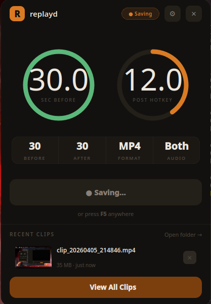
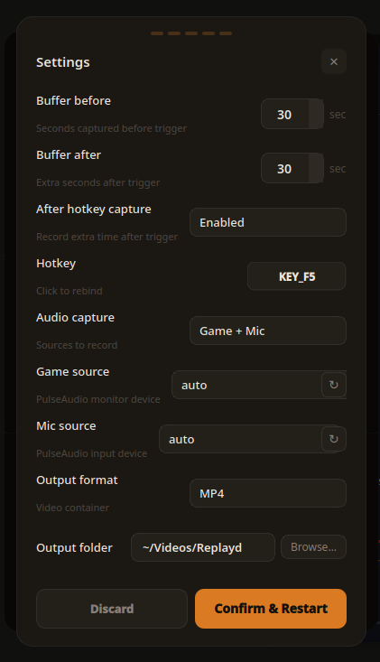
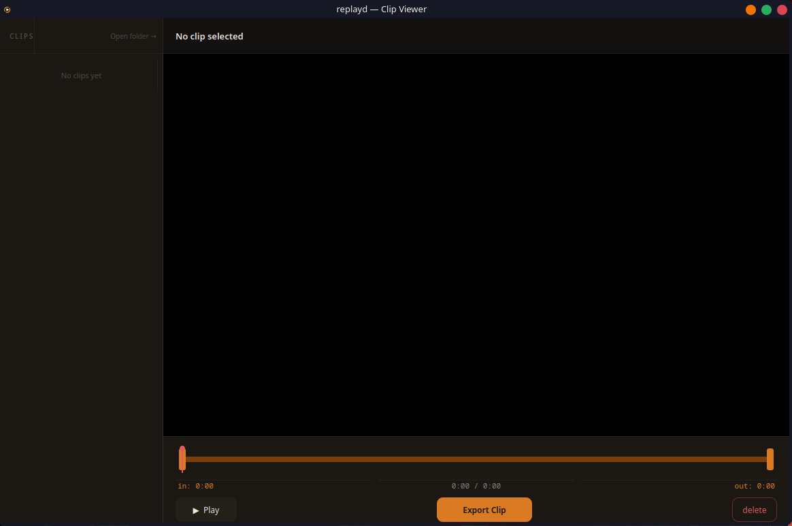

# replayd

Wayland instant replay for Linux. Records continuously in the background — press a hotkey after something happens and it saves the last N seconds as a clip. Think ShadowPlay or Outplayed, but for any Wayland desktop.

Built on Bazzite, works on anything running Wayland + PipeWire.

---

<div align="center">
  
  <br/><sub>Main window</sub>
</div>

---


<div align="center">
  
  <br/><sub>Settings</sub>
</div>

---


<div align="center">
  
  <br/><sub>Clip editor — trim, mix audio, export</sub>
</div>

---

## Features

- Rolling buffer with configurable before/after window
- Global hotkey via **xdg-desktop-portal GlobalShortcuts** — no `input` group, no root
- Screen capture via **xdg-desktop-portal ScreenCast** — Flatpak-compatible
- Hardware encoding: VA-API (Intel/AMD), NVENC (NVIDIA), software H.264 fallback
- Game audio + mic as separate tracks — remix them freely in the clip editor
- Built-in clip editor: trim, per-track volume control, export
- Settings UI — no need to touch `config.json` by hand

---

## Requirements

- Linux + Wayland (KDE Plasma, GNOME, Hyprland, Sway — X11 not supported)
- PipeWire with `pipewire-pulse`
- Python 3.10+
- Any GPU (hardware encoding preferred, software always works)

---

## Installation

```bash
git clone https://github.com/rgtd-faustino/replayd.git
cd replayd
bash install.sh
```

Log out and back in after installing if prompted.

> **Immutable distros (Bazzite, Silverblue, etc.):** the installer skips system packages automatically since GStreamer, ffmpeg and PipeWire are already pre-installed. Python deps go to your home directory as usual.

---

## Usage

```bash
python3 main.py
```

The window appears bottom-right and the tray icon goes live. Default hotkey is **F5** — press it after something happens and the clip saves automatically.

---

## Configuration

Use the ⚙ button in the app. Changes take effect after a restart (the app restarts itself).

| Field | Default | Description |
|---|---|---|
| `seconds_before` | `30` | Seconds before hotkey to include |
| `seconds_after` | `30` | Seconds after hotkey before saving |
| `hotkey` | `KEY_F5` | Shortcut key |
| `output_dir` | `~/Videos/Replayd` | Where clips go |
| `output_format` | `mp4` | `mp4` or `mkv` |
| `video_codec` | `h264` | `h264`, `h265`, `av1`, `h264_soft`, `nvenc_h264`, `nvenc_h265`, `nvenc_av1` |
| `audio_mode` | `both` | `game`, `mic`, or `both` |
| `recording_resolution` | `native` | Downscale before encoding (`1280x720`, etc.) |
| `video_bitrate_kbps` | `0` | Bitrate cap — `0` means encoder default |

---

## Troubleshooting

**Hotkey not working** — check that `xdg-desktop-portal` is running and supports GlobalShortcuts (requires xdg-desktop-portal ≥ 1.18, KDE Plasma 6 or GNOME 45+). On first launch the compositor may ask you to confirm the binding. The Save Clip button always works as fallback.

**Black screen / no video** — a screen picker appears on first launch, select your monitor. If it never showed up: `systemctl --user status xdg-desktop-portal`. To change source later, open Settings.

**"Wayland not detected"** — make sure you're on a native Wayland session (e.g. "Plasma (Wayland)", not "Plasma (X11)").

**"PipeWire is not running"** — `systemctl --user start pipewire pipewire-pulse wireplumber`

**Codec not found** — open Settings, switch to H.264 (Software). The app also auto-detects and falls back on startup.

---

## Dependencies

Python: `dbus-next`, `pulsectl`, `PyQt6`, `qasync`

System: `ffmpeg`, `gstreamer` + plugins (base, good, bad, libav, vaapi, pipewire), `pipewire`, `wireplumber`

---

## License

GPL v3 — see [LICENSE](LICENSE).

© 2026 rgtd-faustino